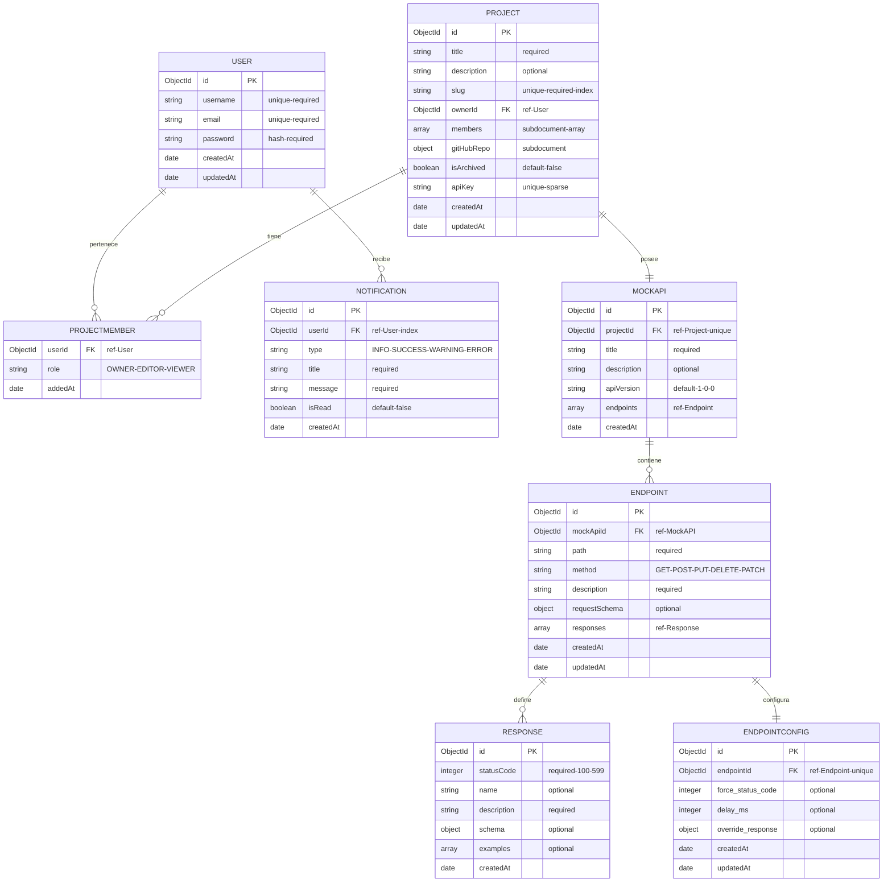
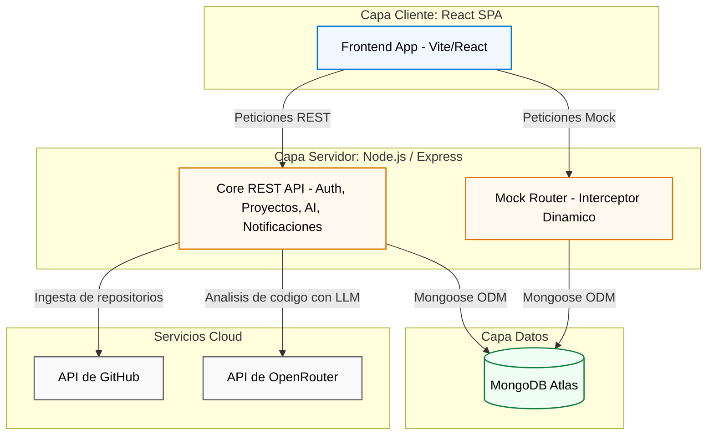
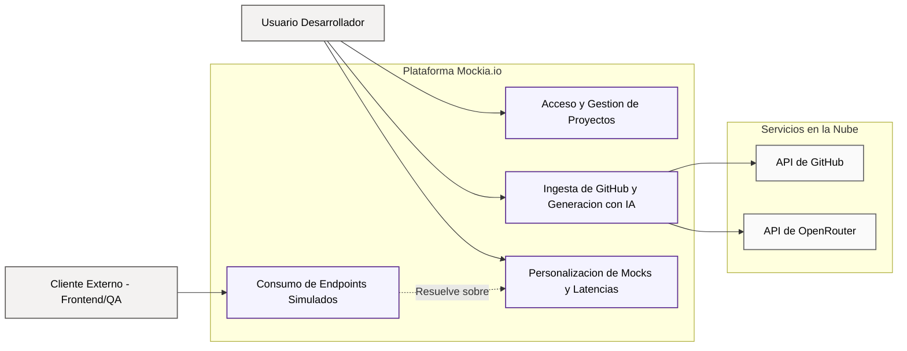
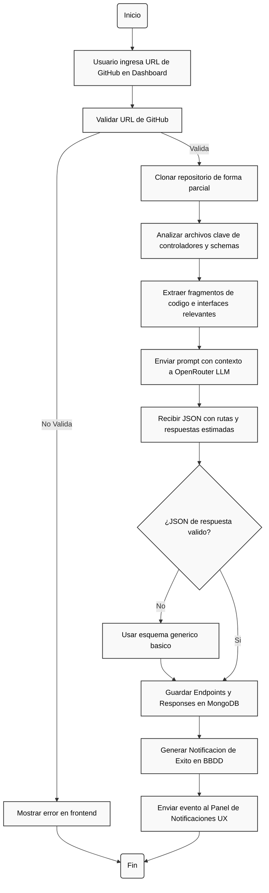
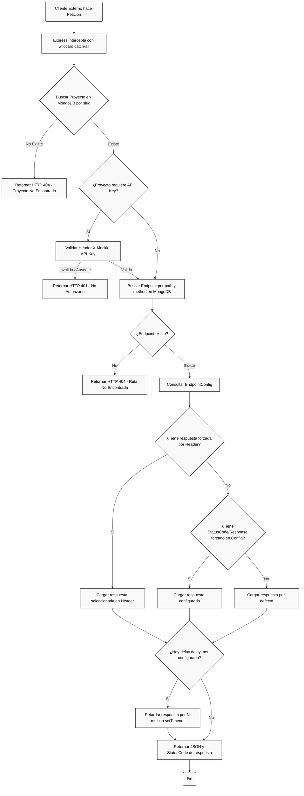

# Apartado 5: Diseño del Sistema

Este apartado detalla el diseño conceptual y lógico del sistema de Mockia.io, incluyendo el prototipo visual de la interfaz (Figma), la estructura relacional/documental en MongoDB, el diagrama entidad-relación (ER), el diagrama de arquitectura física y lógica, el diagrama de casos de uso, los diagramas de flujo de los procesos principales y el diseño detallado de la API REST (endpoints, métodos y respuestas).

---

## 5.1 Prototipo Figma

El diseño visual de la interfaz de Mockia.io se prototipó de forma iterativa y funcional en Figma antes del desarrollo.
- **Acceso al Prototipo Interactivo:** [Mockia.io Figma Interactive Prototype](https://www.figma.com/design/AwPy6Q8UwZrXtGBYpr9cIV/Proyecto-Mockia.io?m=auto&t=e1ozWaJmS2b6hTJt-6)
- **Alcance del Diseño:**
  - **Landing Page:** Flujo de captura y presentación de la propuesta de valor con simplificación de landing.
  - **Auth Flows (Login/Register):** Tarjetas de autenticación minimalistas con feedback de estados.
  - **Dashboard:** Panel interactivo con listado de proyectos, buscador y modales de creación.
  - **Mock Editor (Core UI):** Interfaz compleja de triple panel vertical:
    - *Columna Izquierda:* Selector de endpoints y métodos (GET, POST, etc.).
    - *Columna Central:* Editor de código JSON en tiempo real para visualizar y modificar esquemas de respuesta autogenerados.
    - *Columna Derecha:* Detalle del endpoint seleccionado y panel de configuración de tipo y errores HTTP.

---

## 5.2 Modelo de Datos y Esquemas NoSQL (MongoDB)

Para modelar la información se ha optado por una base de datos documental **MongoDB** debido a la naturaleza dinámica de los mocks (donde las estructuras JSON de respuesta son sumamente variadas y variables). A través de **Mongoose**, se estructuran esquemas rígidos para el control de la aplicación, pero flexibles para las definiciones de mocks, implementando claves externas, subdocumentos, índices y validaciones complejas.

### Relaciones del Sistema:
- **Usuario a Proyectos (N:M de hecho):** Un usuario puede ser miembro de múltiples proyectos, y un proyecto tiene un array de miembros que referencian a `User` con roles específicos (`OWNER`, `EDITOR`, `VIEWER`).
- **Proyecto a MockAPI (1:1):** Cada proyecto tiene asociado un único espacio de especificación de API simulada.
- **MockAPI a Endpoints (1:N):** Una API simulada contiene múltiples rutas y métodos de enrutamiento.
- **Endpoint a Respuestas (1:N):** Cada endpoint define múltiples respuestas HTTP posibles (ej. código 200 con éxito, 400 con error de validación, 500 con error interno).
- **Endpoint a EndpointConfig (1:1):** Relación dedicada que almacena las sobreescrituras en caliente y configuraciones de latencia o códigos de estado forzados.
- **Usuario a Notificaciones (1:N):** Notificaciones del sistema personalizadas para cada usuario.

---

## 5.3 Diagrama Entidad-Relación de la base de datos (MER)

A continuación se presenta el Diagrama ER que detalla la arquitectura de colecciones, campos, claves primarias/externas y las cardinalidades del sistema de base de datos de Mockia.io:



### Optimización mediante Índices

Para garantizar respuestas en milisegundos en el Mock Router (donde se intercepta el tráfico en caliente de clientes externos), se han definido índices estratégicos en Mongoose:
- **Índice Único y Minúsculo en Slug:** `projectSchema.index({ slug: 1 }, { unique: true })` para carga rápida de proyectos en interceptores.
- **Índice Compuesto de Miembros:** `projectSchema.index({ 'members.userId': 1, isArchived: 1 })` para optimizar el Dashboard del usuario.
- **Índices Compuestos de Enrutamiento:** `endpointSchema.index({ mockApiId: 1, method: 1 })` para acelerar la resolución de endpoints del Mock Router en tiempo real.

---

## 5.4 Arquitectura de la Aplicación

Mockia.io utiliza una arquitectura desacoplada estructurada en capas diferenciadas, construida como un **Monorepo** con npm workspaces y TypeScript de extremo a extremo.

1. **Capa Cliente (Frontend SPA):** Construida con **React.js + Vite**. Utiliza **SCSS Modules** para encapsulación de estilos y **TanStack Query (React Query) + Axios** para la sincronización del estado del servidor.
2. **Capa Servidor (Backend API & Mock Router):** Servidor **Node.js con Express.js**. Se divide en:
   - **Filtros/Middlewares:** Validadores de JWT, Helmet, CORS, Rate Limiters, y validadores de esquemas Joi.
   - **Controladores y Modelos:** Módulos de lógica empresarial (Auth, Projects, Endpoints, Users, AI, Notifications).
   - **Servicios Especializados:** Motor de ingesta de GitHub, cliente API de OpenRouter, y planificadores de tareas en segundo plano.
   - **Motor Mock Router:** Servidor interceptor de peticiones en caliente (`/mock/:projectSlug/*`) que emula latencias artificiales e inyecta códigos de error de red.
3. **Capa de Datos:** **MongoDB Atlas** gestionado mediante **Mongoose ODM**.
4. **Interfaces Externas:** **OpenRouter API** (integración LLM) y **API de GitHub** (ingesta de repositorios).



---

## 5.5 Diagrama de Casos de Uso

Este diagrama de casos de uso describe las interacciones entre los diferentes actores (Usuario Anónimo, Usuario Autenticado, Clientes de API de prueba y servicios externos de terceros) y los principales módulos del sistema.



---

## 5.6 Diagramas de Flujo de los Procesos Principales

### 5.6.1 Proceso A: Ingesta desde GitHub y Generación Automatizada con IA

Describe el flujo secuencial del sistema desde que el usuario solicita la importación de un repositorio de GitHub hasta que se estructuran y almacenan sus mocks simulados y se le notifica en tiempo real.



### 5.6.2 Proceso B: Enrutamiento Dinámico y Simulación (Mock Router)

Muestra la lógica de resolución de peticiones en caliente cuando un cliente o frontend externo consume una URL de Mockia.io, aplicando reglas de coincidencia de rutas, validación de credenciales, sobreescritura de comportamientos (headers) y simulación de latencias.



---

## 5.7 Diseño de la API (Endpoints, Métodos y Respuestas)

La API Core de Mockia.io sigue principios **RESTful**, utiliza payloads en formato **JSON** y protege sus endpoints privados mediante el estándar de **JSON Web Tokens (JWT)** pasados en la cabecera `Authorization: Bearer <Token>`.

### Tabla General de Endpoints de la API

| Módulo | Método | Endpoint (Ruta) | Auth | Headers / Parámetros | Descripción / Propósito | Código Éxito | Códigos Error |
| :--- | :---: | :--- | :---: | :--- | :--- | :---: | :---: |
| **Autenticación** | `POST` | `/api/auth/register` | No | Body: `username, email, password` | Registra una nueva cuenta de usuario | `201 Created` | `400 Bad Request` |
| | `POST` | `/api/auth/login` | No | Body: `email, password` | Inicia sesión y obtiene tokens de acceso/refresco | `200 OK` | `401 Unauthorized` |
| | `POST` | `/api/auth/refresh` | No | Body: `refreshToken` | Refresca el token de acceso JWT expirado | `200 OK` | `401 Unauthorized` |
| | `GET` | `/api/auth/me` | Sí | `Authorization: Bearer <JWT>` | Obtiene el perfil del usuario autenticado actual | `200 OK` | `401 Unauthorized` |
| **Gestión Proyectos** | `GET` | `/api/projects` | Sí | `Authorization: Bearer <JWT>` | Lista todos los proyectos del usuario | `200 OK` | `401` |
| | `POST` | `/api/projects` | Sí | Body: `title, description` | Crea un nuevo proyecto en el espacio de trabajo | `201 Created` | `400, 401` |
| | `GET` | `/api/projects/:id` | Sí | Parámetro `id` en la ruta | Obtiene detalles y miembros de un proyecto específico | `200 OK` | `401, 404` |
| | `PUT` | `/api/projects/:id` | Sí | Body: `title, description` | Actualiza los datos generales de un proyecto | `200 OK` | `400, 401, 403, 404` |
| | `DELETE`| `/api/projects/:id` | Sí | Parámetro `id` en la ruta | Archiva un proyecto de forma lógica | `204 No Content` | `401, 403, 404` |
| | `DELETE`| `/api/projects/:id/hard`| Sí | Parámetro `id` en la ruta | Elimina de forma física y permanente un proyecto | `204 No Content`| `401, 403, 404` |
| | `POST` | `/api/projects/:id/members`| Sí | Body: `targetEmail, role` | Añade un miembro colaborador al proyecto | `201 Created` | `400, 401, 403, 404` |
| | `DELETE`| `/api/projects/:id/members/:targetUserId`| Sí | Parámetros `id` y `targetUserId` | Elimina a un colaborador del proyecto | `200 OK` | `401, 403, 404` |
| | `POST` | `/api/projects/:id/regenerate-api-key`| Sí | Parámetro `id` en la ruta | Regenera la clave de API pública del proyecto | `200 OK` | `401, 403` |
| | `POST` | `/api/projects/:id/leave`| Sí | Parámetro `id` en la ruta | Permite al usuario actual salirse de un proyecto compartido | `200 OK` | `401, 404` |
| **Ingesta GitHub** | `POST` | `/api/projects/:id/import/github`| Sí | Body: `repoUrl, branch` | Inicia análisis del código del repo e importa rutas | `200 OK` | `400, 401, 404` |
| | `GET` | `/api/projects/:id/context`| Sí | Parámetro `id` en la ruta | Obtiene los ficheros y metadatos importados | `200 OK` | `401, 404` |
| | `DELETE`| `/api/projects/:id/context`| Sí | Parámetro `id` en la ruta | Borra el contexto del repositorio de GitHub | `200 OK` | `401, 404` |
| **Gestión Endpoints** | `GET` | `/api/endpoints` | Sí | Query: `projectId` | Lista los endpoints de mocks del proyecto | `200 OK` | `401, 404` |
| | `POST` | `/api/endpoints/:projectSlug` | Sí | Body: `path, method, description, responses` | Crea una nueva ruta de mock personalizada | `201 Created` | `400, 401` |
| | `PUT` | `/api/endpoints/:id` | Sí | Body: `path, method, description, responses, config` | Actualiza un mock, sus respuestas y delay | `200 OK` | `400, 401, 404` |
| | `DELETE`| `/api/endpoints/:id` | Sí | Parámetro `id` en la ruta | Elimina una ruta de mock del proyecto | `200 OK` | `401, 404` |
| **Asistente IA** | `POST` | `/api/ai/generate-mock-api-spec`| Sí | Body: `projectId, requirement` | Genera especificación mock estimando rutas y datos | `200 OK` | `400, 401` |
| | `POST` | `/api/ai/generate-and-save`| Sí | Body: `projectId, requirement` | Genera las rutas mediante IA y las guarda en MongoDB | `200 OK` | `400, 401` |
| | `POST` | `/api/ai/generate-mock-data`| Sí | Body: `schemaPrompt` | Genera ejemplos JSON en caliente basados en esquemas | `200 OK` | `400, 401` |
| **Notificaciones** | `GET` | `/api/notifications`| Sí | `Authorization: Bearer <JWT>` | Obtiene las notificaciones del usuario en sesión | `200 OK` | `401` |
| | `POST` | `/api/notifications/mark-read`| Sí | Body: `notificationIds` (Array) | Marca múltiples notificaciones como leídas | `200 OK` | `400, 401` |
| | `DELETE`| `/api/notifications/:id`| Sí | Parámetro `id` en la ruta | Elimina una notificación del historial | `200 OK` | `401, 404` |
| **Mock Router** | `POST` | `/api/mock/resolve-route`| Sí | Body: `projectSlug, method, path` | Resuelve qué endpoint simularía una ruta dinámica | `200 OK` | `400, 401, 404` |
| | `GET` | `/api/mock/endpoints/:projectSlug`| Sí | Parámetro `projectSlug` en ruta | Devuelve catálogo público/privado de endpoints | `200 OK` | `401, 404` |
| | `ANY` | `/mock/:projectSlug/*` | Sí | Cabecera requerida: `X-Mockia-API-Key` | Intercepta y devuelve el mock JSON dinámico simulado | `Variable` | `401, 404` |

---

### Ejemplos de Payload de Petición y Respuesta

Para ilustrar la estructura de datos que maneja el sistema, se exponen a continuación ejemplos clave de payloads de la API:

#### 1. Iniciar Sesión (`POST /api/auth/login`)
**Petición (JSON):**
```json
{
  "email": "alejandro@mockia.io",
  "password": "SuperSecurePassword123!"
}
```
**Respuesta (`200 OK`):**
```json
{
  "success": true,
  "data": {
    "accessToken": "eyJhbGciOiJIUzI1NiIsInR5cCI6IkpXVCJ9...",
    "refreshToken": "eyJhbGciOiJIUzI1NiIsInR5cCI6IkpXVCJ9.refresh...",
    "user": {
      "id": "6444eb1c4fe01a2f64c679a1",
      "username": "alejandro",
      "email": "alejandro@mockia.io"
    }
  }
}
```

#### 2. Crear un Endpoint Mock (`POST /api/endpoints/mi-proyecto-slug`)
**Petición (JSON):**
```json
{
  "path": "/v1/products/:id",
  "method": "GET",
  "description": "Obtener detalles de un producto por identificador único",
  "responses": [
    {
      "statusCode": 200,
      "name": "Éxito",
      "description": "Producto encontrado correctamente",
      "schema": {
        "type": "object",
        "properties": {
          "id": { "type": "string" },
          "name": { "type": "string" },
          "price": { "type": "number" },
          "inStock": { "type": "boolean" }
        }
      },
      "examples": [
        {
          "id": "prod-100",
          "name": "Teclado Mecánico RGB",
          "price": 89.99,
          "inStock": true
        }
      ]
    },
    {
      "statusCode": 404,
      "name": "No Encontrado",
      "description": "El producto con el ID especificado no existe",
      "examples": [
        {
          "error": "Product not found",
          "code": "PRODUCT_NOT_FOUND"
        }
      ]
    }
  ]
}
```
**Respuesta (`201 Created`):**
```json
{
  "success": true,
  "data": {
    "id": "6444eb4d4fe01a2f64c679b3",
    "path": "/v1/products/:id",
    "method": "GET",
    "description": "Obtener detalles de un producto por identificador único",
    "responses": [
      {
        "id": "6444eb4d4fe01a2f64c679b4",
        "statusCode": 200,
        "name": "Éxito",
        "description": "Producto encontrado correctamente",
        "examples": [
          {
            "id": "prod-100",
            "name": "Teclado Mecánico RGB",
            "price": 89.99,
            "inStock": true
          }
        ]
      },
      {
        "id": "6444eb4d4fe01a2f64c679b5",
        "statusCode": 404,
        "name": "No Encontrado",
        "description": "El producto con el ID especificado no existe",
        "examples": [
          {
            "error": "Product not found",
            "code": "PRODUCT_NOT_FOUND"
          }
        ]
      }
    ],
    "createdAt": "2026-05-19T11:18:37.000Z"
  }
}
```

#### 3. Simulación desde el Mock Router (`GET /mock/mi-proyecto-slug/v1/products/prod-100`)
**Petición HTTP:**
```http
GET /mock/mi-proyecto-slug/v1/products/prod-100 HTTP/1.1
Host: api.mockia.io
X-Mockia-API-Key: mk_live_72fa41bdc0...
```
**Respuesta (`200 OK`):**
```json
{
  "id": "prod-100",
  "name": "Teclado Mecánico RGB",
  "price": 89.99,
  "inStock": true
}
```
