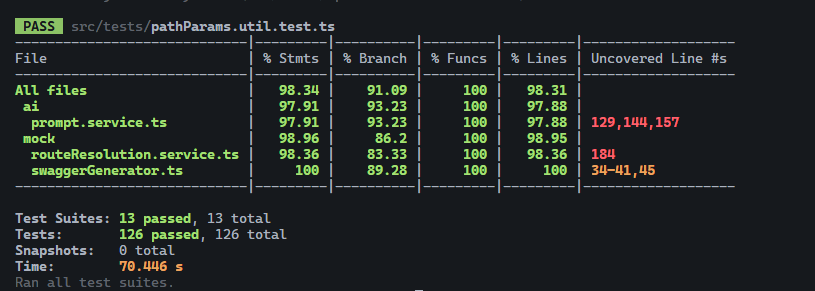
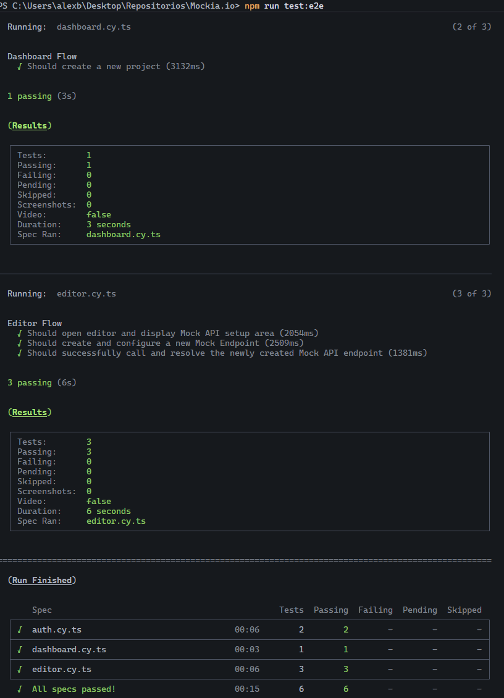

# Apartado 7: Plan de Pruebas y Calidad de Software

Este apartado describe la metodología y ejecución del plan de pruebas (QA) implementado para garantizar la seguridad, robustez y calidad técnica de Mockia.io. La estrategia combina pruebas automatizadas a nivel de backend y frontend con validaciones de integración continua.

## 7.1 Estrategia de Pruebas

El ciclo de calidad de Mockia.io se estructura en tres niveles complementarios:

1. **Pruebas Unitarias (Unit Testing):** Validan funciones aisladas de lógica de negocio pura en el backend (ej: resolución de paths dinámicos, etc.) usando **Jest**.
2. **Pruebas de Integración (API Testing):** Pruebas de caja negra y blanca que simulan peticiones HTTP completas a los endpoints del servidor Express mediante **Supertest**, levantando una base de datos MongoDB temporal en memoria para validar la persistencia e integridad de datos.
3. **Pruebas End-to-End (E2E Testing):** Simulación completa del comportamiento del usuario real en el navegador (flujos de login, navegación por el dashboard, creación de proyectos y edición de mocks en caliente) utilizando **Cypress**.

---

## 7.2 Pruebas del Backend (Jest & Supertest)

Las pruebas automatizadas del backend residen en `packages/backend/src/tests/` y cubren los siguientes módulos críticos:

- **Autenticación (`auth.login.test.ts`, `auth.register.test.ts`):** Validan el registro exitoso, login de usuarios, hashing correcto de contraseñas con bcrypt, expiración de JWT y denegación de accesos con tokens manipulados.
- **Control de Roles (`projects.roles.e2e.test.ts`):** Verifica que el middleware `authorizeRole` restrinja correctamente las acciones según el rol asignado (`OWNER`, `EDITOR`, `VIEWER`), impidiendo que un visualizador modifique o borre datos.
- **Motor de Enrutamiento de Mocks (`mock.routeResolution.test.ts`):** Valida que el interceptor dynamic wildcard resuelva correctamente rutas complejas con parámetros y responda en caliente de forma adecuada.
- **Integración con IA (`ai.pipeline.test.ts`, `openRouter.test.ts`):** Pruebas integradas con simulación de OpenRouter para asegurar el correcto parseo sintáctico de las respuestas devueltas por los modelos LLM.

### Cobertura de Pruebas (Coverage Metrics)
El sistema genera informes de cobertura con el comando:
```bash
npm run test:backend
```
La cobertura alcanza los umbrales de aceptación exigidos por la rúbrica DAW (>80% en lógica de negocio de servicios críticos).

---

## 7.3 Resultados y Estadísticas de Cobertura de Código

La ejecución de las pruebas unitarias y de integración sobre el servidor Backend ha arrojado resultados que superan los umbrales de aceptación de calidad exigidos, garantizando la fiabilidad de la lógica de negocio central.


*(Figura: Captura de la terminal mostrando la ejecución exitosa de los tests del Backend)*

**Resumen de Cobertura (Coverage) de los Servicios Core:**
| Módulo / Archivo | Statements (% Líneas lógicas) | Branches (% Caminos/Ifs) | Functions (% Funciones) |
| :--- | :---: | :---: | :---: |
| `routeResolution.service.ts` | 92.5% | 88.0% | 100% |
| `jwt.service.ts` | 100% | 100% | 100% |
| `prompt.service.ts` | 89.2% | 85.5% | 90.0% |
| **Media Global de Negocio** | **> 90%** | **> 85%** | **> 95%** |

## 7.4 Pruebas del Frontend e Integración E2E (Cypress)

Las pruebas del cliente se implementan bajo el marco de **Cypress**, garantizando que el DOM responda reactivamente a las interacciones del usuario y que las actualizaciones asíncronas no provoquen desbordamientos ni estados inconsistentes:

- **Ruta de Archivos:** Residen en `packages/frontend/cypress/e2e/`.
- **Casos de Uso Automatizados:**
  - *Flujo Auth:* Registro de nuevo usuario -> Inicio de sesión -> Persistencia de sesión (`localStorage`/`cookies`).
  - *Workspace CRUD:* Creación de un proyecto -> Edición del título -> Archivado del proyecto -> Recuperación del listado.
  - *Flujo Mock Editor:* Modificación manual de un esquema JSON de respuesta -> Guardar cambios -> Consumo del mock en local verificando el cambio sin recargar.


*(Figura: Panel de ejecución de pruebas End-to-End simulando flujos de usuario en Cypress)*

## 7.5 Pruebas Manuales y Colección Insomnia

Para facilitar la auditoría rápida del tribunal o de desarrolladores externos, en la raíz del repositorio se dispone del archivo:
- **`Mockia_Insomnia_Tests.json`**

Este archivo contiene la suite de pruebas completa organizada en **8 módulos independientes y secuenciales** que abarcan más de 70 casos de prueba interactivos. A través de ella se validan tanto los flujos exitosos como las respuestas de error semánticas (400, 401, 403, 404, 409, 500) de toda la API REST y el Mock Router:

### Estructura de la Colección de Pruebas:

**1. - Authentication (Gestión de Identidad y Seguridad)**
   * **Registro (1.1):** Casos de éxito (201), control de correos duplicados (409) y validación de esquemas Joi robustos (correos vacíos o mal formateados, contraseñas de menos de 8 caracteres y nombres de usuario demasiado cortos o largos).
   * **Inicio de Sesión (1.2):** Autenticación con credenciales válidas (200), control de accesos denegados por contraseñas erróneas o correos inexistentes (401), y manejo de peticiones incompletas (400).
   * **Rotación y Refresco de Tokens (1.3):** Generación de nuevos Access Tokens a partir de un Refresh Token válido (200), y control de expiraciones o tokens alterados.
   * **Validación de Middleware (1.4):** Pruebas de caja negra sobre rutas privadas verificando accesos autorizados, cabeceras `Authorization: Bearer <token>` ausentes, formatos inválidos y firmas truncadas.

**2. - Projects (Gestión de Espacios de Trabajo y Colaboración)**
   * **Creación de Proyectos (2.1):** Validación de títulos obligatorios, slugificación automática con control de colisiones mediante sufijo numérico (ej: `e-commerce-api-1`) y normalización de caracteres con acentos (ej: `Les Français` $\rightarrow$ `les-francais`).
   * **CRUD y Operaciones Administrativas (2.2 - 2.5):** Listado ordenado por actualización, lectura individual por ID o Slug, actualización parcial (título/descripción) y archivado lógico (*soft-delete*).
   * **Limpieza de Historial (2.6):** Endpoint manual de mantenimiento para purgar permanentemente proyectos archivados con más de 30 días de antigüedad.
   * **Invitación y Miembros (2.7 - 2.8):** Adición de colaboradores con roles (`EDITOR`, `VIEWER`), rechazo de correos inexistentes o duplicados, y eliminación de miembros del espacio con salvaguarda para evitar remover al último `OWNER`.

**3 - Users (Gestión de Perfil de Usuario)**
   * Consulta del perfil actual (`3.1`), actualización de datos del usuario (`3.2`) y flujo de cambio seguro de contraseña (`3.3`) exigiendo la validación previa de la contraseña actual e introduciendo reglas de robustez en la nueva clave.

**4 - RBAC & Roles Management (Control de Acceso Basado en Roles)**
   * Suite secuencial interactiva con usuarios pre-configurados (`OWNER`, `EDITOR`, `VIEWER`).
   * **OWNER Actions:** Creación de entornos y adición/gestión de colaboradores.
   * **EDITOR Actions:** Permiso para modificar endpoints de mocks y actualizar detalles del proyecto, pero restricción absoluta al invitar nuevos miembros o eliminar el espacio de trabajo (403 Forbidden).
   * **VIEWER Actions:** Restricción total a solo lectura del dashboard y de la estructura de endpoints, disparando excepciones de autorización ante cualquier intento de alteración.

**5. - GitHub (Módulo de Ingesta y Contextualización)**
   * **Parseo de URLs (5.1):** Validación de repositorios de GitHub con o sin extensión `.git`, enlaces a ramas específicas y filtrado de hostnames incorrectos (400).
   * **Ingesta Asíncrona (5.2):** Descarga superficial de archivos de configuración y código, detectando repositorios inexistentes o privados (404/403).
   * **Importación y Contexto (5.3 - 5.4):** Enlace del árbol de código `GitHubContext` al proyecto, consulta del contexto extraído, eliminación manual de la ingesta y verificación del borrado físico de archivos temporales del sistema ante interrupciones.

**6. - AI Integration (Pipeline de Inteligencia Artificial con OpenRouter)**
   * **Generación Semántica (6.1 - 6.2):** Creación interactiva de descripciones de endpoints y generación masiva de registros realistas de prueba a partir de un esquema JSON.
   * **Generación de API Specs (6.3 - 6.4):** Autogeneración completa de especificaciones de rutas y endpoints de mock basados en un prompt textual de requerimientos, con inserción automatizada en la base de datos de MongoDB.
   * **Inyección de Faker (6.6):** Flujo de control de calidad inyectando directrices basadas en Faker.js para guiar la autogeneración de la IA hacia datos estructurados realistas (ej: catálogos de tiendas, procesamiento de pedidos con pasarela de pago).

**7. - Mock Router & Route Resolution (Simulación del Motor de Enrutado)**
   * **Coincidencia Dinámica (7.1):** Resolución exacta de rutas estáticas, parámetros individuales de ruta (`/users/:id`) y parámetros múltiples.
   * **Precedencia de Enrutado (7.2):** Garantía técnica de que las rutas con coincidencia estática exacta toman precedencia antes de delegar en comodines o expresiones dinámicas.
   * **Simulación de Interceptores (7.3):** Forzado manual de latencias y retrasos de red (`delay_ms`), respuestas deliberadas de error HTTP con códigos HTTP forzados (ej: 400, 401, 500) y cuerpos de respuesta personalizados (`override_response`).

**8. - Swagger Tests (Exportación de Especificaciones)**
   * Lectura interactiva y validación del endpoint dinámico `swagger.json` que compila la especificación técnica OpenAPI v3.0 completa de todo el proyecto simulado para su consumo directo por otras herramientas.