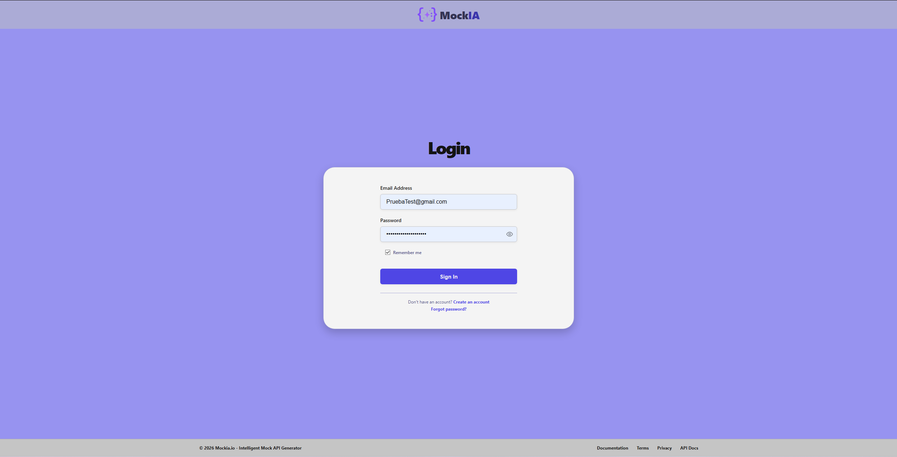
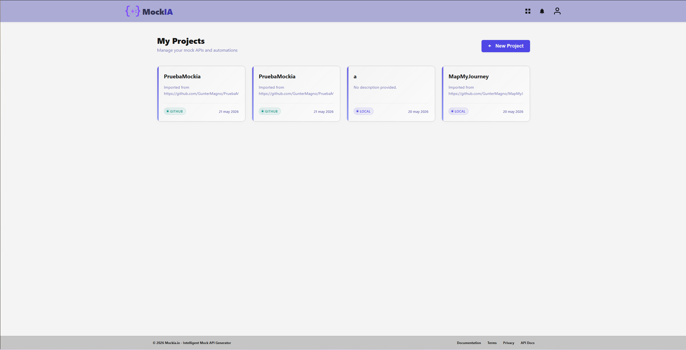
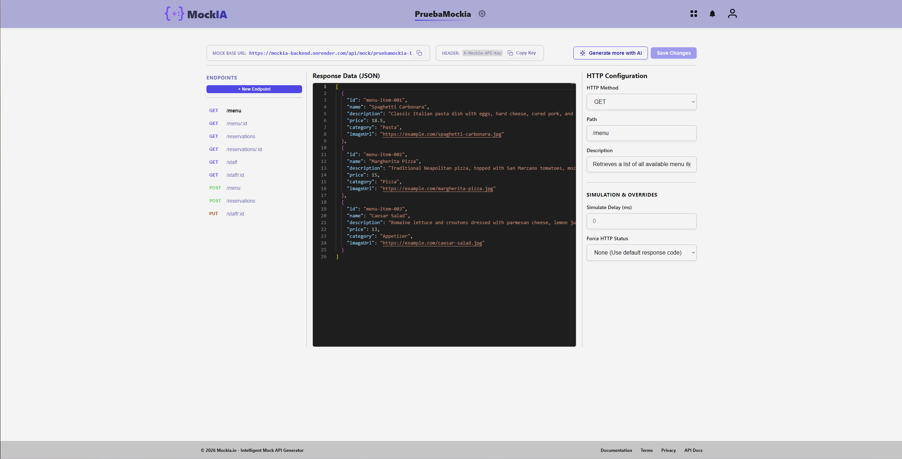

# Apartado 9: Manual de Usuario de la Aplicación

Este manual describe el flujo de trabajo y la experiencia de usuario (UX) en Mockia.io, guiando paso a paso sobre cómo registrarse, gestionar proyectos, autogenerar APIs simuladas con IA y configurarlas en el editor.

## 9.1 Acceso y Gestión de Identidad (Auth)

1. **Registro (Sign Up):** Navegue a la página de registro. Ingrese su nombre de usuario, correo electrónico y contraseña. El sistema validará la seguridad de su contraseña e inputs.
2. **Inicio de Sesión (Log In):** Introduzca sus credenciales registradas. Marque **Remember me** para mantener la persistencia de su sesión durante 7 días.

*(Interfaz de autenticación de usuario)*

## 9.2 El Dashboard de Proyectos

Al iniciar sesión, el usuario accede al **Dashboard**, la sala de mandos principal de Mockia.io:

1. **Creación de un Proyecto:** Haga clic en **New Project**. Rellene el título y el sistema generará un **slug único** (ej: `e-commerce-api`) y una **API Key** privada asociada.
2. **Listado de Proyectos:** Visualice todos sus proyectos activos. Puede invitar a miembros ingresando su correo y asignando roles (`EDITOR`, `VIEWER`) desde el modal de configuraciones para trabajar colaborativamente.

*(Panel principal de visualización de espacios de trabajo)*

## 9.3 Ingesta y Autogeneración Inteligente (AI Pipeline)

El valor diferencial de Mockia.io es la autogeneración instantánea analizando el código del propio repositorio.

1. **Vincular GitHub:** En la sección "Import" de su proyecto, introduzca la URL de su repositorio público de GitHub y presione **Import Repository**. 
2. **Generación con IA:** En el panel de generación de IA, introduzca en lenguaje natural qué desea generar. Presione **Generate Mock API**.
3. El motor analizará el código y creará las respuestas JSON con datos de muestra realistas (nombres reales, fechas, importes válidos) de forma automática.

## 9.4 El Editor de Mocks (Mock Editor)

La interfaz interactiva tri-columna es el centro de control del mock:

1. **Visualizar Endpoints:** La barra lateral izquierda muestra el catálogo de rutas coloreadas semánticamente (GET en azul, POST en verde).
2. **Editor JSON en Vivo (Panel Central):** Edite el JSON de respuesta autogenerado directamente en el editor integrado.
3. **Configuración y Simulación (Panel Derecho):**
   - **Simular Latencia de Red (Delay):** Ingrese un valor (ej: `2000` para 2 segundos). Cualquier petición a esta ruta sufrirá ese retraso artificial.
   - **Forzar Códigos de Error (Force Status):** Marque códigos como `400` o `500` para forzar que el mock devuelva esos fallos HTTP de forma intencionada.

*(Interfaz del editor tri-columna de Mockia.io configurando una respuesta)*

## 9.5 Consumo del Servidor Dinámico (Mock Router)

Para integrar las APIs simuladas en su aplicación Frontend o probarlas en Postman:
1. Localice la URL estable expuesta en la parte superior del editor: `https://mockia-backend.onrender.com/mock/:projectSlug/:route`  
2. Realice llamadas Fetch o Axios. El servidor dinámico interceptará las peticiones y responderá con el JSON configurado respetando el retardo.

---

## 9.6 Preguntas Frecuentes (FAQ)

**P: ¿Puedo importar repositorios privados de GitHub?**
R: En la versión actual (MVP), Mockia.io solo soporta el clonado en memoria de repositorios públicos debido a restricciones de seguridad. El soporte para repositorios privados mediante OAuth está planeado para versiones futuras.

**P: ¿Por qué mi API mockeada tarda en responder?**
R: Compruebe el panel de configuración (derecha) en el Editor de Mocks. Es muy probable que usted o algún compañero de su proyecto haya establecido un valor de *Delay (ms)* artificial para probar estados de carga. Póngalo a `0` para que responda instantáneamente. Si no es ese su caso, la primera petición tarda mas en cargar pero hay un sistema de cache para que los siguientes carguen mas rapido.

**P: ¿Cómo sabe el sistema qué datos inventar (ej. Nombres o Precios)?**
R: Nuestro pipeline de Inteligencia Artificial analiza los nombres de las propiedades y los tipos (interfaces) extraídos de su repositorio, combinándolos con la librería interna Faker.js. Si usted define `price: number`, la IA inyectará valores coherentes como `19.99` en lugar de datos basura.